# Capturas del Frontend

Vistas principales de [Descalifica2](https://descalifica2.vercel.app/).

## Inicio

Landing con bienvenida, tabla del campeonato (pilotos/escuderías), resultados por Gran Premio y año, y publicaciones destacadas del foro.

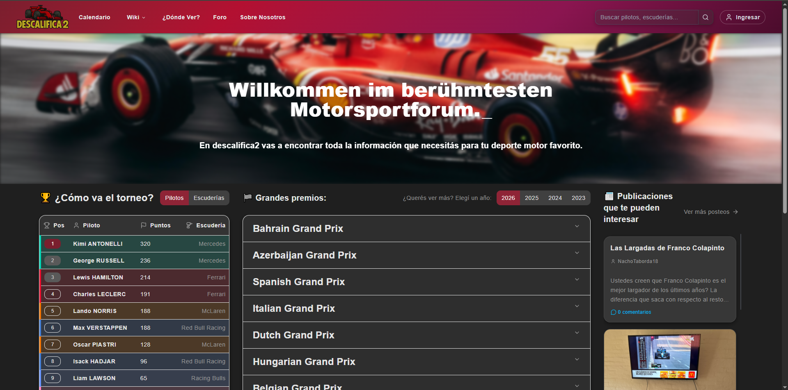

Detalle de un Gran Premio desplegado con el trazado del circuito, las sesiones y la clasificación.

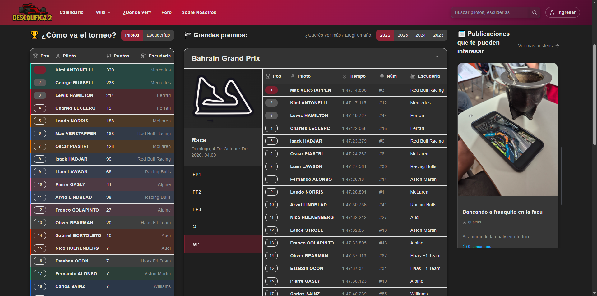

## Calendario

Cuenta regresiva a la próxima sesión y al próximo GP, cronograma del fin de semana y calendario mensual con todas las sesiones.

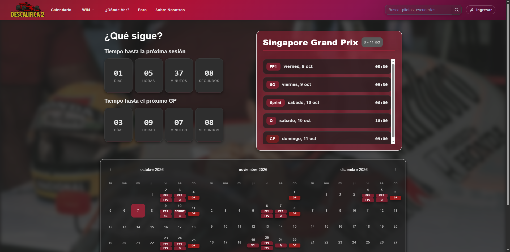

## Wiki

### Pilotos

Listado de pilotos con foto y bandera, con filtro por categoría.

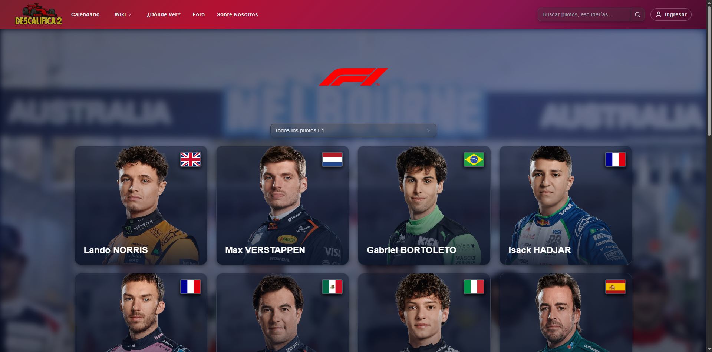

### Circuitos

Grilla de circuitos con su trazado y país.

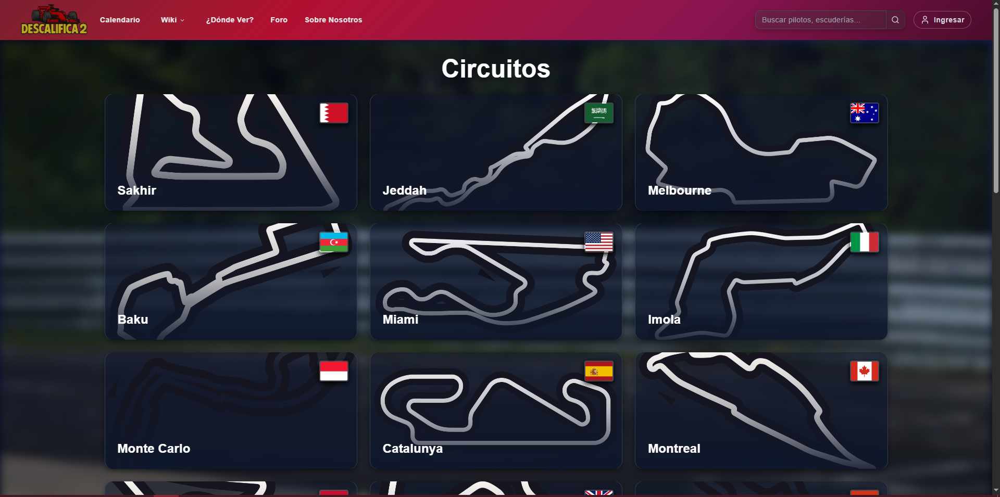

## ¿Dónde ver?

Transmisión de cada GP en Argentina (Disney+ / Fox Sports).

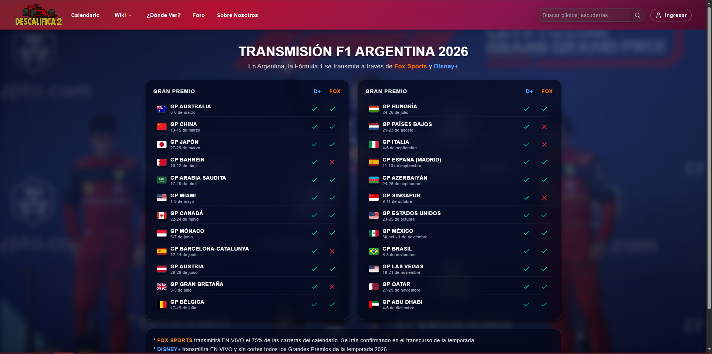

## Foro

Publicaciones de la comunidad con imagen, autor y comentarios.

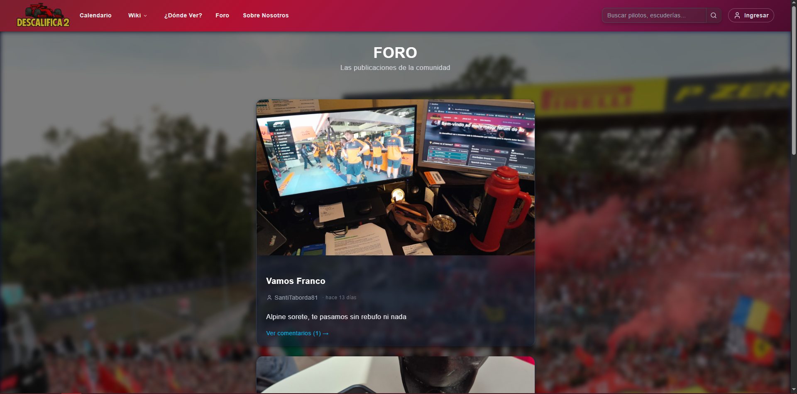

## Inicio de sesión

Login con email/contraseña o con Google.

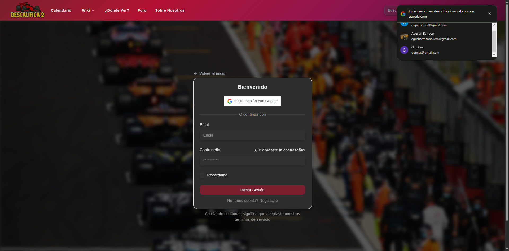

## Registro

Alta de cuenta con datos personales, vinculación opcional con Telegram y preferencias.

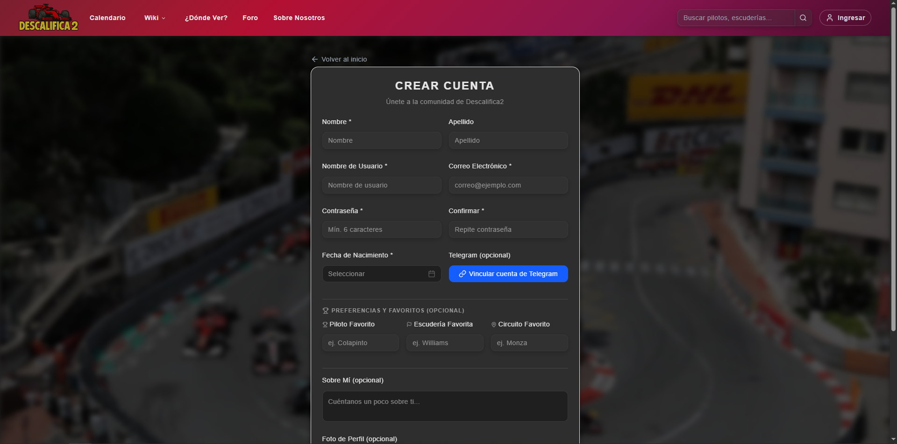

## Perfil

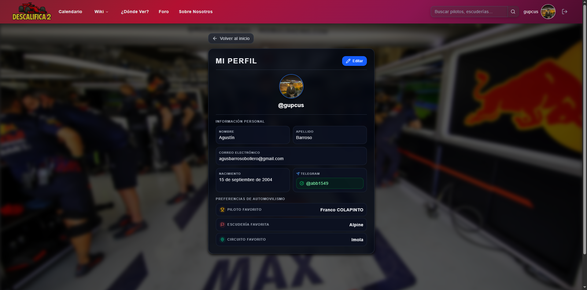

## Página 404

Página mostrada ante rutas inexistentes.

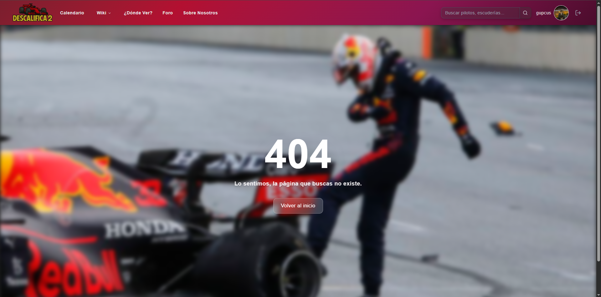
