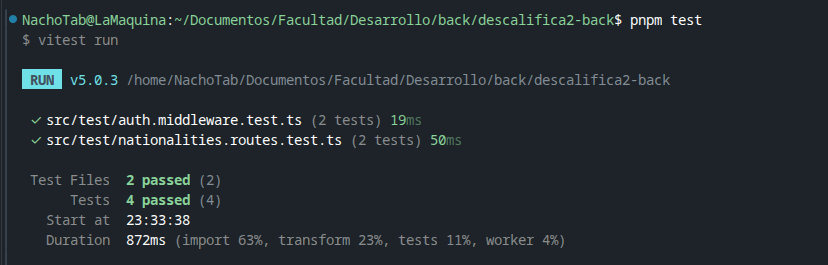
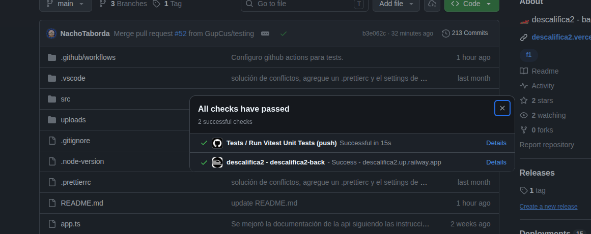
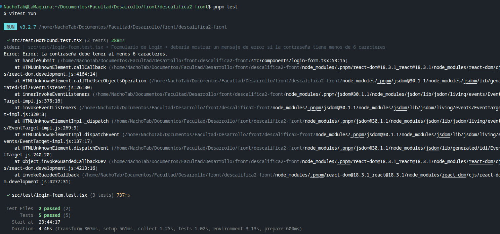
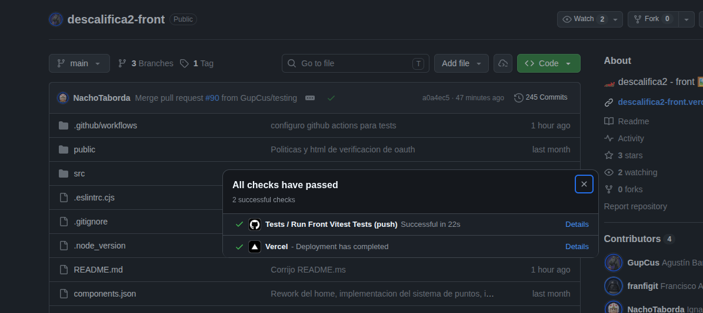

# Evidencia de Testing

En este documento se registran los comandos utilizados para ejecutar las pruebas automatizadas del proyecto y las evidencias de que estas pasaron exitosamente.

De acuerdo a los requisitos de la cátedra, se ha desarrollado al menos **1 test por integrante** del grupo. En nuestro caso implementamos **9 tests automáticos en total** (4 en backend y 5 en frontend).

## Ejecución de los Tests

Ambos tests utilizan **Vitest**.

Para correr la suite de tests, es necesario posicionarse en el directorio correspondiente y ejecutar el siguiente comando:

```bash
pnpm test
```

## Github Actions

Ambos repositorios cuenta con un flujo automatizado de CI (Integración Continua) configurado con Github Actions, el cual ejecuta la suite de tests automáticamente ante cada push o pull request hacia las ramas principales:

• Backend CI: GitHub Actions - descalifica2-back https://github.com/GupCus/descalifica2-back/actions  
 • Frontend CI: GitHub Actions - descalifica2-front https://github.com/GupCus/descalifica2-front/actions

## Capturas de Resultados

A continuación se adjuntan las capturas de pantalla de la terminal demostrando que todos los tests se ejecutaron y pasaron correctamente:

### Backend - Ejecución Local y CI

Consola local ejecutando pnpm test (4 test aprobados):


Pipeline de Github Actions en verde:


### Frontend - Ejecución Local y CI

Consola local ejecutando pnpm test (5 test aprobados):


Pipeline de Github Actions en verde:

